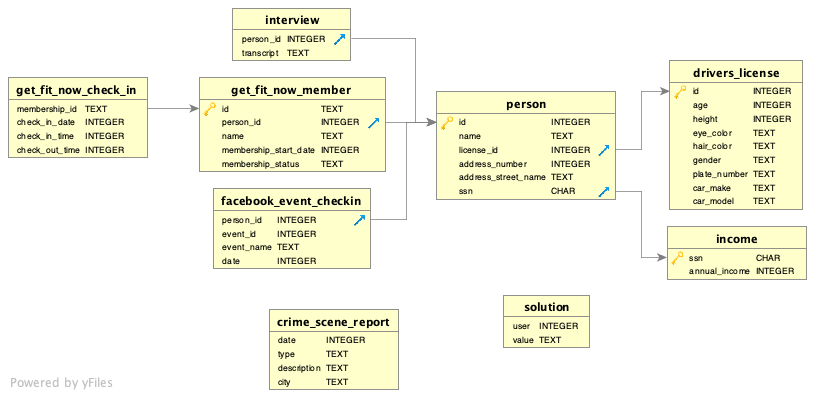

# SQL Murder Mystery

## Context

A crime has taken place and the detective needs your help. The detective gave you the crime scene report, but you somehow lost it. You vaguely remember that the crime was a **murder** that occured **sometimes on Jan.15,2018** and that it took place in **SQL City**. Start by retrieving the corresponding crime scene report from the police department's database.

All the clues to this mystery are buried in a huge database, and you need to use SQL to navigate through the vast network of information. The first step to solving the mystery is to retrieve the cooresponding crime scene report from the police department's database. 

Here is the Entity Relationship Diagram:

**Credits**

The SQL Murder Mystery was created by Joon Park and Cathy He while the were Knight Lab fellows. See the GitHub repository for more information (https://github.com/NUKnightLab/sql-mysteries).

Adapted and produced for the web by Joe Germuska.

This mystery was inspired by a crime in the neighboring Terminal City.

Web-based SQL is made possible by SQL.js.

SQL query custom web components created and released to the public domain by Zi Chong Kao, creator of Select Star SQL.

Detective illustration courtesy of Vectors by Vecteezy.

Original code for this project is released under the MIT Licence.

Original text and other content for this project is released under Creative Commons CC BY-SA 4.0.

## Repository content
1. Queries to solve the murder (made with Visual Code Studio): vsc_sql_murderer_mystery.ipynb.
2. Query output (pdf): output_sql_murder_mystery.pdf.
3. ERD (Entity Relationship Diagram) of the database: erd_sql_murder_mystery.png.
4. Illustration for the game: illustration_sql_murder_mystery.png.

## Author
Coline Plé
